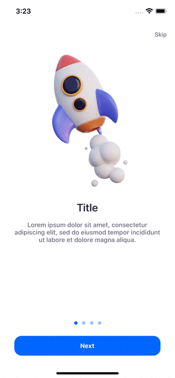
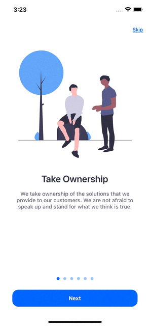

# MobilliumIntroduction

[](https://github.com/mobillium/MobilliumIntroduction/actions/workflows/ci.yml)
[](https://cocoapods.org/pods/MobilliumIntroduction)
[](https://img.shields.io/badge/Swift_Package_Manager-compatible-orange?style=flat-square)
[](https://cocoapods.org/pods/MobilliumIntroduction)
[](https://cocoapods.org/pods/MobilliumIntroduction)

## Example

To run the example project, clone the repo, and run `pod install` from the Example directory first.

## Requirements

- iOS 11.0+
- Swift 5.0+

## Installation

### Cocoapods

MobilliumIntroduction is available through [CocoaPods](https://cocoapods.org). To install
it, simply add the following line to your Podfile:

```ruby
pod 'MobilliumIntroduction'
```

#### Swift Package Manager

The [Swift Package Manager](https://swift.org/package-manager/) is a tool for automating the distribution of Swift code and is integrated into the `swift` compiler.    
Once you have your Swift package set up, adding MobilliumQRCodeReader as a dependency is as easy as adding it to the `dependencies` value of your `Package.swift`.

```swift
dependencies: [
    .package(url: "https://github.com/mobillium/MobilliumIntroduction.git", .upToNextMajor(from: "1.0.0"))
]
```

## Usage
MobilliumIntroduction comes with these configs which you can customize for your requirements.

Create own IntroductionController and get result from `IntroductionControllerDelegate`.

- Content
- ContentStyle
- Image
- Title
- Description
- SkipButton
- NextButton
- PageControl

For each content, you can choose one of four content styles.
```swift
    public enum ContentStyle: CaseIterable {
        case topImageCenterAlignedText
        case topImageLeftAlignedText
        case bottomImageCenterAlignedText
        case bottomImageLeftAlignedText
    }
```

| Basic | Advanced |
| --- | --- |
|  |  |

##### Basic usage for preview:
```swift
    let introductionController = IntroductionController()
    present(introductionController, animated: true)
```

##### Advanced usage:
```swift
    let titlesAndDescriptions: [String: String] = [
        "Make Great Things": "We build products that are fast, effortless to use and aesthetically pleased. We roll up our sleeves and create things worthy of our clients’ and users’ time.",
        "Deliver Results": "There’s nothing like watching your app come alive. Each week we deliver a build of your app with release notes on what’s new, updated, fixed, or in progress.",
        "Embrace Transparency": "Each idea, code commit, or design concept is put into a shared space. You don’t just get an email that shows what we did when we’re done.",
        "Seek Mastery": "We build products that are fast, effortless to use and aesthetically pleased. We roll up our sleeves and create things worthy of our clients’ and users’ time.",
        "Take Ownership": "We take ownership of the solutions that we provide to our customers. We are not afraid to speak up and stand for what we think is true.",
        "Have Fun": "We believe businesses that encourage having fun are the ones where the best people do their best work."
    ]

    let contents: [IntroductionConfig.Content] = titlesAndDescriptions.compactMap {
        IntroductionConfig.Content(
            title: IntroductionConfig.Title(text: $0.key),
            description: IntroductionConfig.Description(text: $0.value),
            image: IntroductionConfig.Image(image: UIImage(named: $0.key.replacingOccurrences(of: " ", with: ""))!)
        )
    }

    let skipButton = IntroductionConfig.SkipButton(
        attributedTitle: NSAttributedString(
            string: "Skip",
            attributes: [
                NSAttributedString.Key.foregroundColor: UIColor(red: 0.0 / 255.0, green: 102.0 / 255.0, blue: 255.0 / 255.0, alpha: 1.0),
                NSAttributedString.Key.underlineStyle: NSUnderlineStyle.single.rawValue
        ])
    )

    let pageControl = IntroductionConfig.PageControl(
        currentPageIndicatorTintColor: UIColor(red: 0.0 / 255.0, green: 102.0 / 255.0, blue: 255.0 / 255.0, alpha: 1.0),
        pageIndicatorTintColor: UIColor(red: 0.0 / 255.0, green: 102.0 / 255.0, blue: 255.0 / 255.0, alpha: 0.4)
    )

    let nextButton = IntroductionConfig.NextButton(
        title: "Next",
        lastTitle: "Let's Go",
        titleColor: .white,
        backgroundColor: UIColor(red: 0.0 / 255.0, green: 102.0 / 255.0, blue: 255.0 / 255.0, alpha: 1.0)
    )

    let config = IntroductionConfig(
        contents: contents,
        skipButton: skipButton,
        pageControl: pageControl,
        nextButton: nextButton
    )

    let introductionController = IntroductionController(config: config)
    introductionController.delegate = self
    present(introductionController, animated: true)
```

##### IntroductionControllerDelegate:
```swift
    func introductionController(_ controller: IntroductionController, willDisplay index: Int)
    func introductionController(_ controller: IntroductionController, didEndDisplaying index: Int)
    func didSkipButtonTapped()
    func didNextButtonTappedAtEndOfContents()
```

## License

MobilliumIntroduction is available under the MIT license. See the LICENSE file for more info.
